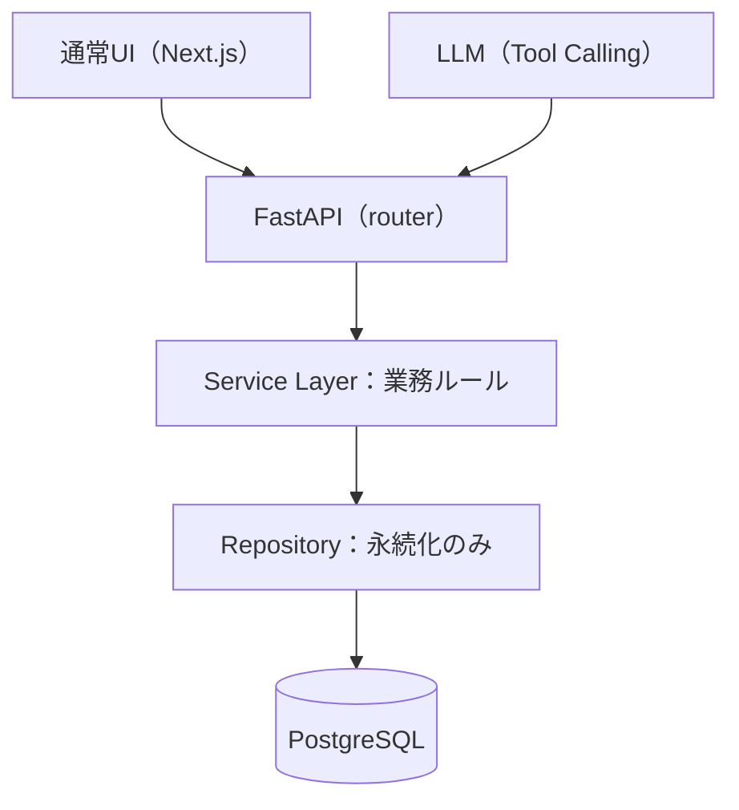
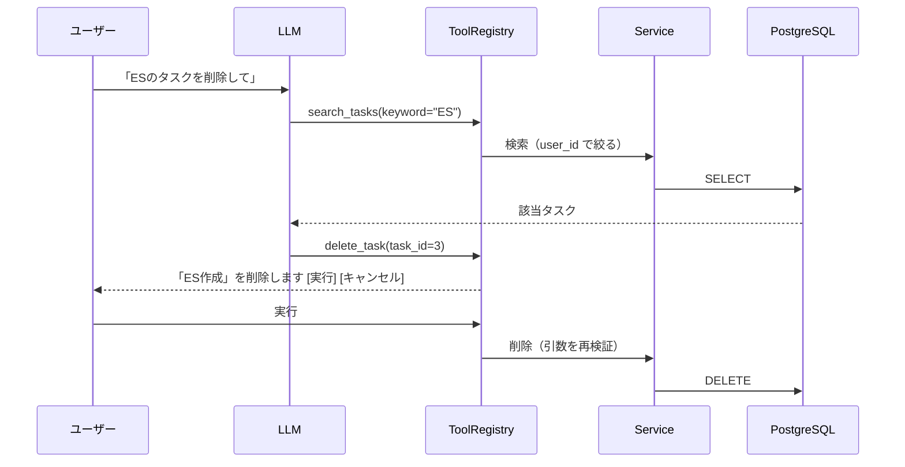
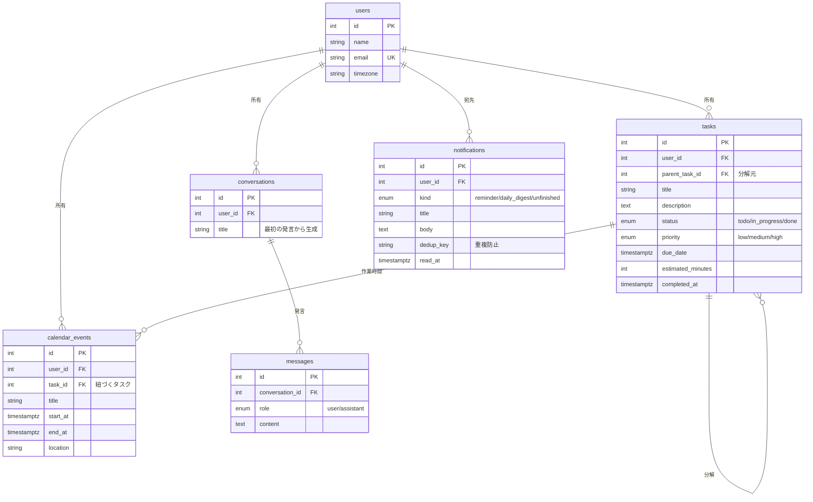

# AI Task Manager

通常のUIと自然言語の**どちらからでも**操作できる、タスク・スケジュール管理アプリケーション。

同じデータを2つの経路から操作できる。UIで作ったタスクをAIが編集でき、AIが作った予定をUIから動かせる。
**AIが使えない環境でも、通常UIだけで全機能が完結する。**

```
「明日の14時から2時間、企業研究を入れて」  → カレンダーに予定が入る
「今日が期限のタスクを教えて」              → 一覧が返る
「空いている時間にタスクを配置して」        → 配置案を提示 → 承認 → 登録
```

---

## 特徴

### 1. 通常UIとLLMが同じ Service Layer を通る



LLM に専用の処理経路を作らない。Tool は必ず既存の Service を呼ぶため、
UIから作ったデータとAIから作ったデータが食い違わない。

### 2. LLM にデータベースを触らせない

LLM が実行できる操作は Tool として明示的に定義したものだけ。
引数は Pydantic で検証してから Service に渡す。



削除・タスク分解・自動配置・再配置は**即時実行しない**。
承認を実行する専用ツールは LLM に提示すらしない（`exposed=False`）。

### 3. 認証とデータ分離

セッションは **httpOnly / SameSite=Lax の Cookie** で保持する。
JWT を localStorage に置く方式と比べ、XSS でトークンを持ち出されない。
SameSite=Lax により、他サイトからのリクエストには Cookie が付かないため CSRF 対策にもなる。

「現在のユーザー」を決めるのは `get_current_user` の1箇所だけで、
全てのデータ操作がここを通る。Repository の問い合わせにも必ず `user_id` 条件が入る。

### 4. LLM を差し替えられる

```
LLMProvider（抽象）
├── OllamaProvider   ローカル実行・API料金なし
└── ClaudeProvider   Claude API
```

`.env` の1行で切り替わる。Tool 定義の形式差（Claude と Ollama で異なる）は
各 Provider の内部に閉じ込めてある。

---

## 画面

```
┌──────────────────────────────────────────────────────────┐
│ 通知: まもなく開始: 模擬面接 / 20:52 から始まります      │
├────────────────┬─────────────────────────────────────────┤
│ タスク 7件     │ カレンダー 2026/9/21 - 9/27             │
│                │                                          │
│ □ 提出物の確認 │  9/21  9/22  9/23  9/24  9/25          │
│   期限切れ     │ 09:00 面接                              │
│ □ ES作成       │ 13:00 企業研究  ES作成                  │
│   今日 18:00   │ 14:00 OB訪問                            │
│ □ ESを完成させる│  ← 空き枠クリックで作成                 │
│   └ 企業研究   │  ← ドラッグで時間移動                   │
│   └ 志望動機   │  ← 赤い点線はタスクの締切               │
├────────────────┴─────────────────────────────────────────┤
│ AI Assistant                    ollama / qwen3:1.7b      │
│ 「明日2時間空いている時間を探して」                       │
│ → 12:00〜14:00（120分）、16:00〜22:00（360分）            │
└──────────────────────────────────────────────────────────┘
```

---

## 技術構成

| 層 | 技術 | 選定理由 |
| --- | --- | --- |
| Frontend | Next.js (App Router) / TypeScript / Tailwind CSS | カレンダーのドラッグ操作など状態の多いUIをクライアント側で扱うため。型をBackendのスキーマと1対1で対応させている |
| Backend | FastAPI / Pydantic | LLM の Tool 引数検証と API の入力検証を**同じ Pydantic スキーマ**で書けるため。OpenAPI が自動生成される |
| ORM | SQLAlchemy 2.0 / Alembic | 型注釈ベースのモデル定義と、スキーマ変更の履歴管理 |
| DB | PostgreSQL | タイムゾーン付き日時（timestamptz）と ENUM、部分一致検索のため |
| AI | Ollama / Claude API | Provider を抽象化し、ローカル実行と API の両方に対応 |
| 非同期 | Celery / Redis | リマインダーと定期処理 |

### データモデル



外部キーの削除時の挙動には意味を持たせている。

- `tasks.user_id` → CASCADE（ユーザーを消せばデータも消える）
- `calendar_events.task_id` → **SET NULL**（タスクを消しても、確保した時間は予定として残す）
- `tasks.parent_task_id` → **SET NULL**（親を消しても小タスクは単独で残る）

---

## AI の機能

| 種類 | Tool | 承認 |
| --- | --- | --- |
| タスク | create / get / search / update / complete / delete / create_subtasks | 削除・分解のみ必要 |
| カレンダー | create / get / search / update / delete | 削除のみ必要 |
| スケジュール | find_free_time / generate_schedule / reschedule_unfinished | 配置・再配置は必要 |

### スケジューリングの規則は Backend が持つ

「いつ空いているか」「どの順で埋めるか」を LLM に推測させない。

- 並び順: **期限が近い → 優先度が高い → 所要時間が長い**
- 制約: 稼働時間 9:00-22:00 / 1日の作業上限 6時間 / 土日除外（任意）
- 既存予定を避け、期限に間に合わない配置はしない
- タスクの「時間を確保」ボタンから、AI を通さずに1件だけ自動配置することもできる
- 置けなかったタスクは**理由つき**で返す

---

## セットアップ

```bash
# 1. データベース
createdb ai_task_manager
createdb ai_task_manager_test

# 2. Backend
cd backend
python3 -m venv .venv
./.venv/bin/pip install -r requirements.txt
cp .env.example .env
./.venv/bin/alembic upgrade head
./.venv/bin/uvicorn app.main:app --reload --port 8000

# 3. Frontend
cd ../frontend
npm install
cp .env.local.example .env.local
npm run dev
```

- アプリ: http://localhost:3000
- API ドキュメント: http://localhost:8000/docs

初回は画面から**アカウントを登録**する。`/auth/*` と `/health` 以外はログインが必要。

> **注意**: フロントの `NEXT_PUBLIC_API_BASE_URL` には、画面と同じホスト名を使うこと。
> `localhost` と `127.0.0.1` は SameSite 判定で別サイト扱いになり、
> セッション Cookie が送られなくなる。

Docker で DB を動かす場合は `docker compose up -d db`（ホスト側ポート 5433）。

### AI アシスタント（任意）

LLM が無くても通常UIだけで全機能を利用できる。

```bash
# ローカル LLM（料金なし）
ollama serve &
ollama pull qwen3:1.7b
```

```
LLM_PROVIDER=ollama
OLLAMA_MODEL=qwen3:1.7b
```

Claude API を使う場合は `LLM_PROVIDER=claude` と `ANTHROPIC_API_KEY` を設定する。
APIキーは `.env` にのみ置き、Git にもフロントエンドにも渡さない。

### Google カレンダー連携（任意）

連携すると Google 側の予定も避けて空き時間を探す。
取得するのは「埋まっている時間帯」だけで、予定のタイトルは取得しない。

設定手順は [docs/Google連携.md](docs/Google連携.md)。
`GOOGLE_CLIENT_ID` が未設定なら機能は表示されない。

> テストモードの OAuth クライアントは更新トークンが**7日で失効する**。
> 失効すると画面に「つなぎ直す」ボタンが出る（黙って無視しない）。

### バックグラウンド処理（任意）

```bash
cd backend
./.venv/bin/celery -A app.worker.celery_app worker --loglevel=info --pool=solo
./.venv/bin/celery -A app.worker.celery_app beat --loglevel=info
```

| 定期処理 | タイミング | 内容 |
| --- | --- | --- |
| リマインダー | 5分ごと | 30分以内に始まる予定を通知 |
| 今日のまとめ | 毎朝 7:00 | その日の予定と期限のタスクを通知 |
| やり残し確認 | 毎晩 23:00 | 終わらなかった作業を通知 |

**macOS では `--pool=solo` が必要。** 既定の prefork プールは macOS のプロセス起動方式と
相性が悪く `not enough values to unpack` で失敗する。

---

## テスト

```bash
cd backend && ./.venv/bin/python -m pytest -q     # 202件
cd frontend && npm test                            # 40件
```

Backend のテストは、CRUD だけでなく以下を含む。

- **権限分離**: 他人のタスク・予定・会話・通知に触れないこと（404 を返す）
- **Tool Calling**: 引数の検証、エラー時の差し戻し、承認フロー、連鎖実行、往復の上限
- **スケジューリング**: 空き時間の計算、重なる予定の統合、配置順序、1日の上限、期限超過
- **アーキテクチャ**: ToolRegistry が直接DBを触っていないこと
- **セキュリティ**: 入力長の上限、リクエストサイズ、CORS

---

## ローカルLLMで実測したこと

開発機は Intel Core i5-7360U / 8GB RAM（2017年モデル）。CPU 推論のため、
**入力トークン数が応答時間に直結する**。計測して次の対策を入れた。

| 対策 | 効果 |
| --- | --- |
| 現在日時をシステムプロンプトから利用者メッセージへ移動 | プロンプトキャッシュが効き **102秒 → 19秒** |
| Tool スキーマの簡略化（`anyOf: [型, null]` と文字数制限を除去） | 2338 → 1992 トークン |
| `temperature=0` | Tool 選択のブレを抑制 |
| `num_ctx=6144` | 既定の 4096 では Tool 定義と履歴が溢れて切り捨てられる |
| `think=false` | qwen3 の思考トークンは CPU では高コスト |

1つ目が効いた理由は、システムプロンプトに現在時刻があると分が変わるたびに
「システムプロンプト＋Tool定義」が別物になり、LLM 側のプロンプトキャッシュが
毎回捨てられるため。固定部分と可変部分を分けることで 95% を再利用できるようになった。

### 小型モデルの限界と、その前提での設計

`qwen3:1.7b` は単発の指示（作成・検索・空き時間の探索）は扱えるが、
検索してから更新するような2段階の指示は安定しない。
**ツールを呼ばずに「削除しました」と答えることもある。**

ただしこの構成では、LLM が何を言おうと **Tool を経由しない限りデータは変わらない**。
モデルの誤りがデータ破壊につながらないことを、テストで確認している。

精度を補うために、プロンプトではなく**モデルが必ず読む場所**に正解の形を置いた。

```json
{"error": "タスク (id=1) が見つかりません",
 "next_step": "id を推測してはいけません。search_tasks で対象を検索し、
               返ってきた id を使って呼び直してください。"}
```

---

## ドキュメント

- [API 仕様](docs/API.md) — OpenAPI から生成
- [セキュリティ](docs/セキュリティ.md) — 監査記録と対策
- [Google カレンダー連携](docs/Google連携.md) — 設定手順
- [要件定義書](docs/要件定義書.md)
- [開発手順](docs/開発手順.md)
- [Claude Code での実装手順](docs/claude-code-開発フロー.md)

---

## 今後の課題

- **レート制限**: `/chat` は LLM を呼ぶため、公開時に必要
- **Google カレンダーへの書き出し**: 現在は読み取りのみ（アプリの予定を Google 側へ作る機能は無い）
- フロントエンドのテストはロジック層のみ（コンポーネントのテストは未整備）
